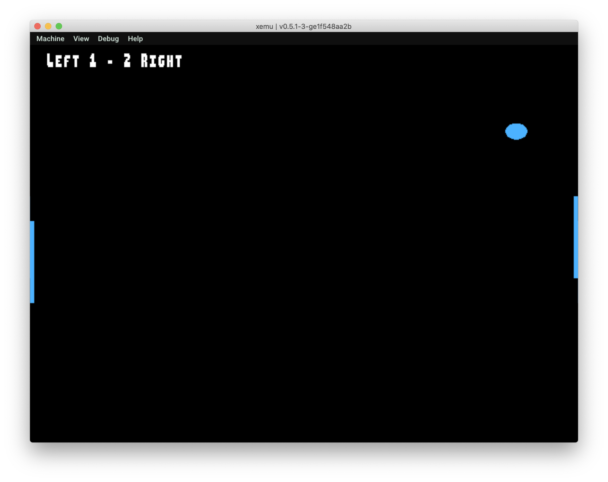

# nxdk-pong-demo
To run the demo you will need an Xbox Emulator (like [moborgerson/Xemu](https://github.com/mborgerson/xemu)).
The setup can be a little ugly, but with a little googling it doesn't take too long ;)

You can download a pre-built `.iso` from the [GitHub releases page](https://github.com/schroffl/nxdk-pong-demo/releases).

The controls are a little weird, because I didn't get the emulator to recognise my Playstation controller.
  * `DPad Up/Down` are for the left player
  * `DPad Left/Right` are for the right player.
  
With Xemu I was able to use my keyboard as a very basic controller where the arrow keys are mapped to the DPad.



# Building the .iso
I use Docker for building, because I couldn't be bothered to install all the nxdk dependencies on my computer.
If you choose to do the same thing, just follow these steps:

  1. `git clone https://github.com/schroffl/nxdk-pong-demo`
  2. `cd nxdk-pong-demo`
  3. `docker-compose up -d`
  4. `docker-compose exec build sh -c "cd /usr/src/app && make"`

It might take a while when you run this for the first time.

***

If you don't want to use Docker, you will need to install nxdk along with all its dependencies.
Before running `make` you will also need to specify the nxdk installation directory.
By default, the pong demo expects it to be in the same directory where the repository itself is located – like this:

```
.
├── nxdk-pong-demo
└── nxdk
```

If you save it somewhere else, you will need to set the `NXDK_DIR` environment variable.

```
$ make NXDK_DIR=/my/nxdk/installation/directory 
```
